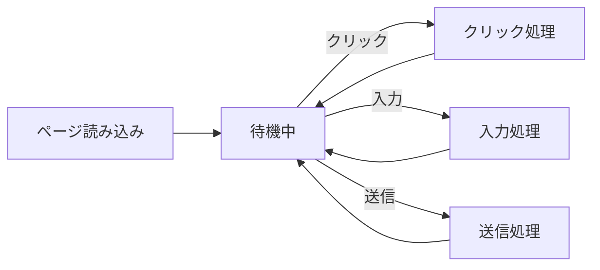

# JavaScriptの全体像 (ブラウザでの実行モデル / 言語の特徴)

## はじめに

JavaScript（ジャバスクリプト）は、Web ページに「動き」を与えるためのプログラミング言語です。HTML がページの構造を、CSS が見た目を担当するのに対し、JavaScript は**ユーザーの操作に応じてページを変化させる役割**を担います。

たとえば次のような動作は、すべて JavaScript によって実現されています。

- ボタンをクリックするとメニューが開く
- フォームに不正な値を入力すると警告が出る
- 「いいね」ボタンを押すとページを再読み込みせずに数字が増える
- 入力に応じて検索候補がリアルタイムに表示される

もともとはブラウザの中で動かすために作られた言語ですが、現在ではサーバー（Node.js）やスマートフォンアプリなど、さまざまな場所で使われています。このモジュールでは、まず**ブラウザの中で動く JavaScript の基礎**に絞って学んでいきます。

> [!NOTE]
> 「JavaScript」と「Java」は名前が似ていますが、まったく別の言語です。歴史的な経緯で似た名前が付けられただけで、文法も用途も異なります。

---

## ブラウザでの実行モデル

### HTML・CSS・JavaScript の役割分担

Web ページは、3 つの技術が協力して作られています。

| 技術 | 役割 | たとえると |
|------|------|------------|
| HTML | 構造・内容 | 建物の骨組み |
| CSS | 見た目・装飾 | 内装・塗装 |
| JavaScript | 動き・処理 | 電気・水道などの設備 |

このうち JavaScript だけが「プログラミング言語」であり、条件分岐や繰り返しといった**処理のロジック**を記述できます。

### `<script>` でブラウザに読み込む

ブラウザは HTML を上から読み込みながら、`<script>` タグに出会うと中の JavaScript を実行します。コードは別ファイルに分けて読み込むのが一般的です。

```html
<!DOCTYPE html>
<html lang="ja">
  <head>
    <meta charset="UTF-8" />
    <title>サンプル</title>
  </head>
  <body>
    <h1>こんにちは</h1>

    <!-- ページ末尾で外部ファイルを読み込む -->
    <script src="main.js"></script>
  </body>
</html>
```

```js
// main.js
console.log("ページが読み込まれました");
```

**ポイント**

- `console.log()` は、ブラウザの「開発者ツール」のコンソールに文字を表示する命令です。動作確認に頻繁に使います。
- `<script>` は `<body>` の末尾（`</body>` の直前）に置くのが基本です。HTML 要素がすべて読み込まれてから JavaScript が実行されるため、安全に画面を操作できます。

> [!TIP]
> 開発者ツールは、Chrome なら `F12` キー、または「右クリック → 検証」で開けます。`Console` タブで `console.log()` の出力を確認できます。

### イベント駆動という考え方

ブラウザの JavaScript は、上から下へ一度実行して終わり、というだけではありません。**「何かが起きたら、それに応じて処理を動かす」**という仕組みでも動いています。これを**イベント駆動（イベントドリブン）**と呼びます。



「ボタンがクリックされた」「キーボードが入力された」といった出来事（イベント）が発生するたびに、あらかじめ登録しておいた処理が呼び出されます。この考え方は、後半の「DOM 操作」「イベント」で詳しく扱います。

---

## 言語の特徴

JavaScript には、初学者がつまずきやすいいくつかの特徴があります。最初に概要だけ押さえておきましょう。

- **動的型付け**: 変数を宣言するときに「数値」「文字列」といった型を指定する必要がありません。値を入れた時点で型が決まり、後から別の型の値を入れ直すこともできます。
- **スクリプト言語**: コンパイル（事前の変換作業）が不要で、ブラウザがそのまま読み込んで実行します。書いてすぐ試せる手軽さが特徴です。
- **柔軟（だが注意も必要）**: 自由度が高い反面、意図しない型変換などで思わぬ挙動をすることがあります。`let` / `const` の使い分けや `===` での比較など、安全に書くための作法を一緒に学びます。

```js
let value = 10; // この時点では数値
value = "テキスト"; // 文字列を入れ直してもエラーにならない
```

> [!NOTE]
> このモジュールでは、まず動く基礎を固めることを優先します。アロー関数や分割代入などの **ES6 以降のモダンな文法**は入口だけ紹介し、詳しい使い分けは別モジュール「モダン JavaScript」で扱います。とはいえ、いまの標準である `let` / `const` は最初から使っていきます。

---

## このモジュールで学ぶこと

ここからは、各トピックを続くレッスンで順番に学んでいきます。前半は**言語の基礎**、後半は**ブラウザ操作（DOM・イベント・非同期）**です。

### 変数と型

データを入れておく「箱」である変数と、扱う値の種類である「型」を学びます。`let` / `const` の使い分けが出発点です。

### 制御構文

「もし〜なら」という条件分岐や、「〜の間くりかえす」というループなど、処理の流れをコントロールする構文を学びます。

### 関数

処理をひとまとめにして名前を付け、何度でも呼び出せるようにする「関数」を学びます。プログラムを整理する基本単位です。

### 配列とオブジェクト

複数の値をまとめて扱う「配列」と、名前付きでデータを管理する「オブジェクト」を学びます。実用的なデータ処理の土台です。

### DOM 操作

JavaScript から HTML 要素を取得し、テキストや見た目を書き換える方法を学びます。ここから「ページを動かす」段階に入ります。

### イベント

クリックや入力といったユーザーの操作に反応して処理を実行する方法を学びます。イベント駆動を実際のコードで体験します。

### 非同期処理

時間のかかる処理（サーバーとの通信など）を、画面を止めずに扱う方法を学びます。`async` / `await` と `fetch` で実際の API からデータを取得します。

---

## まとめ

- JavaScript は Web ページに**動き**を与える言語で、HTML（構造）・CSS（見た目）と役割分担している。
- ブラウザは `<script>` を通じて JavaScript を実行し、**イベント駆動**で「何かが起きたら処理を動かす」仕組みで動作する。
- **動的型付け**などの特徴があり、自由度が高い反面、安全に書くための作法を意識することが大切。
- このモジュールでは、言語の基礎（変数・制御構文・関数・配列とオブジェクト）から、ブラウザ操作（DOM・イベント・非同期）へと段階的に進む。

それでは、最初のトピック「変数と型」から始めましょう。
